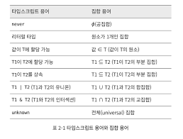

## 아이템 7: 타입이 값들의 집합이라고 생각하기

**타입: 할당 가능한 값들의 집합**

- never: 아무 값도 포함하지 않는 타입. 공집합
- 리터럴 타입: 원소가 1개인 타입
- 유니온 타입: 합집합
- 인터섹션 타입: 교집합

### 구조적 타이핑

```ts
interface Identified {
  id: string;
}
```

어떤 객체가 string으로 할당 가능한 id 속성을 가지고 있다면 그 객체는 Identified 타입이다.

### 유니온과 인터섹션

타입 연산자는 인터페이스의 속성이 아닌, **값의 집합**에 적용된다.

```ts
interface Person {
  name: string;
}

interface LifeSpan {
  birth: Date;
  death?: Date;
}

type PersonSpan = Person & LifeSpan;

const ps: PersonSpan = {
  name: "alex",
  birth: new Date("2000/02/11"),
};
```

```ts
keyof (A&B) = (keyof A) | (keyof B)
keyof (A|B) = keyof A & keyof B // keyof 연산자는 유니온 타입에 적용될 때 공통된 속성을 찾는다.
```

<br>

### 타입스크립트 용어와 집합 용어


